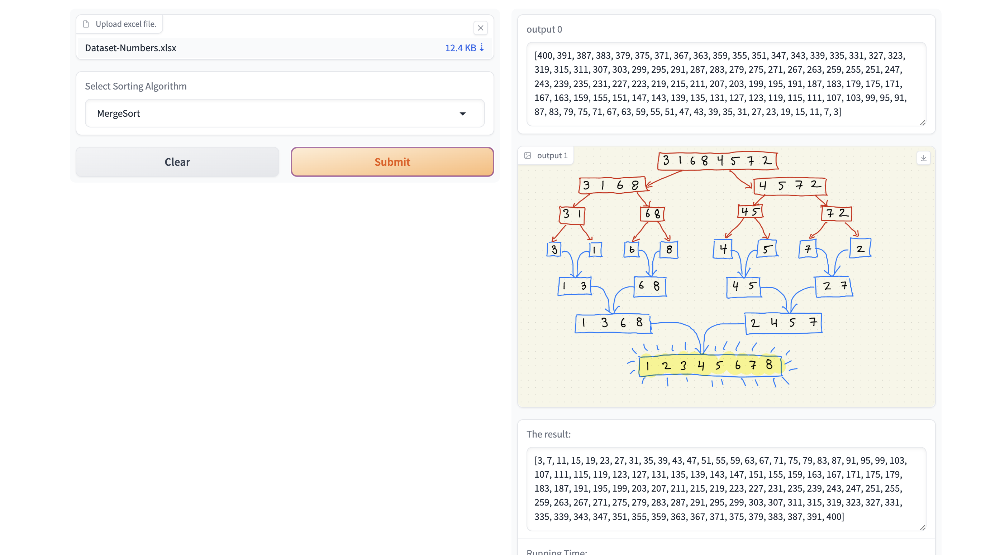

# Interactive Data Sorting and Filtering with Gradio

Welcome to the Interactive Data Sorting and Filtering project! This project leverages Gradio and Pandas to create an interactive web interface for real-time data sorting and filtering.



## Table of Contents
- [Introduction](#introduction)
- [Features](#features)
- [Installation](#installation)
- [Usage](#usage)
- [Project Structure](#project-structure)
- [Contributing](#contributing)
- [License](#license)

## Introduction
This project provides an easy-to-use interface for sorting and filtering data from Excel files. Users can upload an Excel file, select a sorting algorithm, and set filtering conditions. The results are displayed in real-time, making it a valuable tool for both educational and practical applications.

## Features
- **Interactive Interface**: User-friendly web interface for uploading and processing data.
- **Real-time Data Processing**: Immediate feedback on sorting and filtering operations.
- **Multiple Sorting Algorithms**: Support for MergeSort, QuickSort, and SelectionSort.
- **Custom Filters**: Set minimum and maximum values for filtering specific columns.
- **Error Handling**: Informative error messages for guiding users.

## Installation
To set up the project locally, follow these steps:

1. **Clone the Repository**:
   ```bash
   git clone https://github.com/Al-Edrisy/interactive-data-sorting-filtering.git
   cd interactive-data-sorting-filtering
